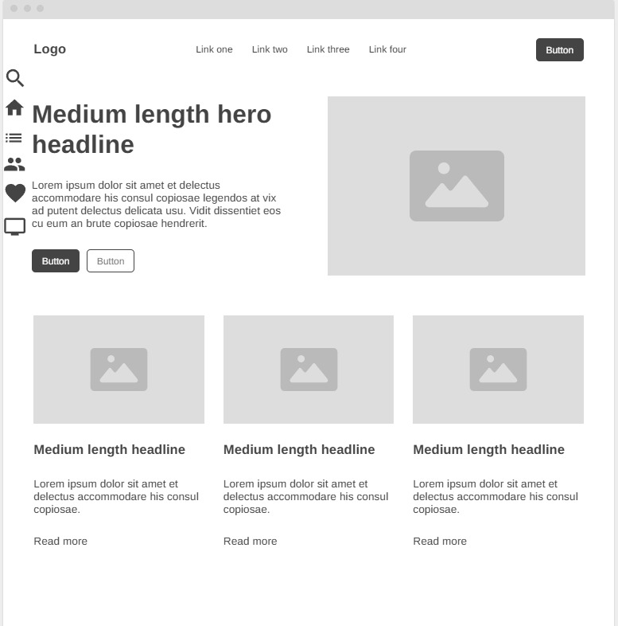
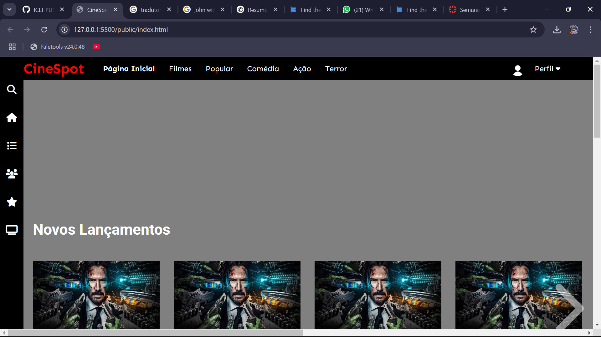

# Trabalho Prático - Semana 03

Dessa vez, vamos escolher uma proposta de projeto para trabalhar. Na [lista de propostas de projetos](propostas-projetos.md), escolha um dentre as alternativas.

Nessa atividade, você deverá montar a página inicial do projeto escolhido, a organização do HTML aplicando semântica correta e uso aprimorado do CSS. Leia o enunciado completo no Canvas para mais detalhes.

**IMPORTANTE:** Você deve trabalhar e alterar apenas arquivos dentro da pasta **`public`**. Deixe todos os demais arquivos e pastas desse repositório inalterados. **PRESTE MUITA ATENÇÃO NISSO.**

## Informações Gerais

- Nome: Tiago dos Reis Gomes
- Matricula: 851405
- Proposta de projeto escolhida: Catálogo de Filmes
- Breve descrição sobre seu projeto: Meu projeto é um site de filmes que tem como objetivo (informar e entreter) conteúdos cinematográficos para os usuários. O site contará com um design intuitivo e recursos como busca por filmes, tornando-se um espaço acessível e atrativo para todos que gostam de cinema.

## Print do esboço criada

## Print da home-page criada

